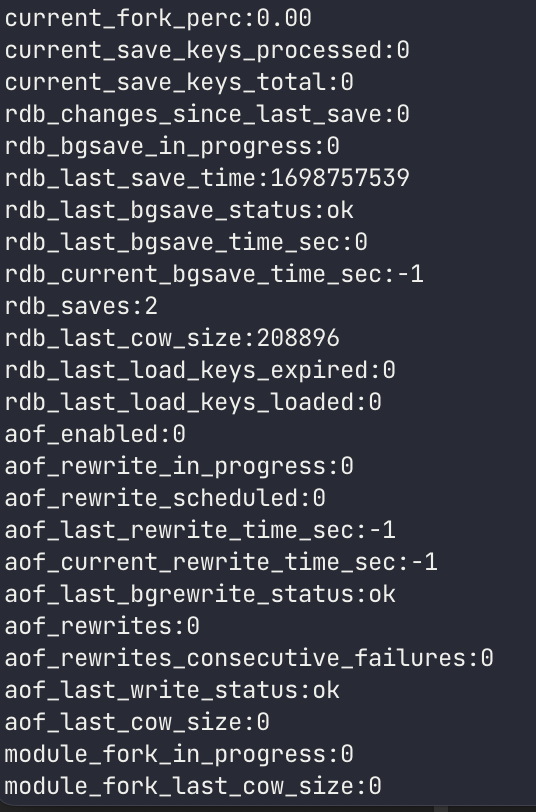

# Redis 운영과 관리

## Redis는 싱글 스레드
Redis는 태생적으로 하나의 명령이 오랜 시간을 소모하는 작업에는 적합하지 않다. 레디스는 싱글 스레드이기 때문이다.

### 1. keys라는 명령어
keys로 서버에 저장된 Key 목록을 열람할 수 있다. 이 명령어를 사용하면 실제 서비스에서 장애로 이어질 수도 있다. 데이터 양이 적을 때는 Redis가
굉장히 빠르다가, 데이터가 10만 ~ 20만 개가 되면서 속도가 느려지기 시작한다. 즉, keys 명령어를 사용하면 db의 모든 Key를 처음부터 끝까지 패턴으로 비교한다.

### 2. flushall/flushdb
Redis는 `flushall`/`flushdb`라는 명령어가 있다. Redis는 db라는 가상의 공간을 분리할 수 있는 개념을 제공하고 select 명령으로 이동할 수 있다.
이를 통해 같은 Key라도 db 0번이나 db 1번 등, db 개수에 따라 여러 개를 만들 수 있다. flushdb는 이런 db 하나의 내용을 통째로 지우는 명령이다. 
그리고 모든 db의 내용을 지울 수 있는 것이 flushall이다. 

또한, Redis의 flushall은 전체 데이터를 다 지우며, keys와 같이 많은 시간이 필요하다. (flushall은 for를 돌면서 지운다. 속도는 O(n))

### 3. Redis Persistent
Redis를 Memcached와 구분하는 특징 중 하나이다. Redis를 데이터 스토어 형태로 사용하면 필수적으로 사용해야 한다. 그러나 이 기능이 장애의 주요 원인이 될 수 있다.

#### 3-1. RDB
Redis에서 현재 메모리 상태를 덤프하는 기능을 `RDB`라고 한다. 현재의 메모리에 대한 스냅샷을 저장하면 Redis는 fork를 통해서 자식 프로세스를 생성한다.
즉, 자식 프로세스가 생성되면 현재 메모리 상태가 복제되므로, 이를 기반으로 데이터를 저장한다. 결과적으로 RDB는 가장 최신의 데이터라기 보다는 특정 시점의 데이터, 
스냅샷이라고 생각해야 한다. 

RDB 저장을 위한 명령으로  `SAVE`, `BGSAVE`가 있다. `SAVE`는 메인 스레드를 사용하고 `BGSAVE`는 자식 프로세스를 생성하는 fork를 통해서
자식에서 RDB를 저장한다.

#### 3-2. AOF
AOF는 "Append Only File"의 약어로 기존 DBMS에서 제공하는 WAL(Write Ahead Log)와 비슷한 기능을 한다. 데이터를 저장하기 전에 AOF
파일에 현재 수행해야 할 명령을 미리 저장하고 장애가 발생하면 AOF 기반으로 복구한다. 

> RDB vs. AOF
> 
> 둘 다 실행됐다면, 복구를 위해서 어떤 것이 우선 순위를 가질까? AOF이다. RDB는 스냅샷이고 AOF는 매 작업마다 디스크에 기록을 남기긱 떄문이다.

#### 4. Redis가 메모리를 두 배로 사용하는 문제
Redis가 운영 중 장애를 일으키는 가장 큰 원인은 RDB를 저장하는 Persistent 기능으로 fork를 사용하기 떄문이다. 이전에 운영체제가 자식 프로세스를 생성하면,
부모 프로세스의 메모리를 모두 자식 프로세스에 복사해야 했다. 그러다 OS 가 발전해서 'COW(Copy On Write)'라는 기술이 개발됐다. 
이에 따라 fork 후, 자식 프로세스와 부모 프로세스의 메모리에서 실제로 변경이 발생한 부분만 차후에 복사하게 됐다. 그러나 Redis를 사용하는 곳은 Write가 많으므로
이전과 마찬가지로 메모리를 두 배로 사용하는 경우가 생긴다.

#### 5. Redis 장애, Read는 가능한데 Write만 실패하는 경우
Redis RDB를 사용하면서 대부분이 경험하는 장애가 Redis는 죽었는데 Heartbeat(Ping)을 보면 이상이 없다고 나오는 경우이다. 
이러한 경우는 RDB 저장이 실패할 때, 기본 설정상 Write 관련 명령이 동작하지 않을 때 발생한다. Redis의 기본 설정상 RDB저장이 실패하면 해당 장비에 이상이 있다고
판단해서 Write는 처리하지 않으며, 데이터가 변경되지 않도록 관리된다. 

그렇가면 RDB 생성에 실패하는 이유는 뭘까?
1. RDB를 실행할 수 없을 정도의 디스크 여유 공간
2. 실제 디스크가 고장 난 경우
3. 메모리 부족으로 자식 프로세스 생성 실패
4. 강제적으로 종료된 자식 프로세스

이를 해결하는 방법은 
1. write를 실행하면 나오는 에러 확인  `(error) MISCONF Redis is configured to save RDB snapshots, but is currently not able to persist on disk. Commands that may modify the data set are disabled. Please check Redis logs for details about the error.`
2. info 명령어로 `rdb_last_bgsave_status` 확인

3. 정책상 write를 허용해도 되는지를 결정하면 된다. 
   1. `config set stop-write-on-bgsave-error no`로 운영 중인 redis에서 변경하거나
   2. redis.conf에 stop-write-on-bgsave-error no를 추가한다.